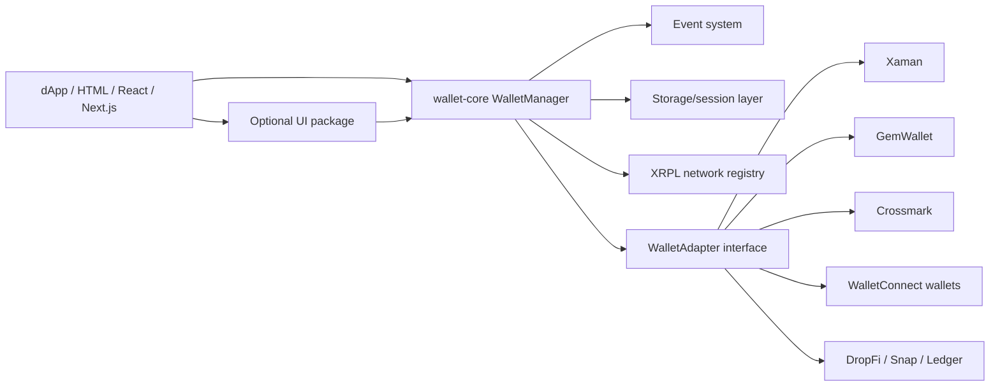

# XRPL Wallet Adapter / XRPL Wallet Kit

Framework-agnostic wallet adapter architecture for XRPL dApps. The core package is headless and can be used from Vanilla JS, React, Next.js, identity flows, NFT domain flows, payments, and transaction signing flows.

This project extracts the wallet flow lessons from XRPDomains `appv5.html` into clean packages. It does not copy the legacy HTML/jQuery/Bootbox implementation.

## Packages

- `@xrpname/wallet-core`: headless manager, interfaces, events, storage, sessions, network registry.
- `@xrpname/wallet-adapter-xaman`: Xaman auth and payload signing adapter.
- `@xrpname/wallet-adapter-gemwallet`: GemWallet browser extension adapter.
- `@xrpname/wallet-adapter-crossmark`: Crossmark extension adapter.
- `@xrpname/wallet-adapter-walletconnect`: XRPL WalletConnect v2 adapter.
- `@xrpname/wallet-adapter-dropfi`: DropFi XRPL injection adapter.
- `@xrpname/wallet-adapter-xrpl-snap`: XRPL Snap adapter for MetaMask Snap flows.
- `@xrpname/wallet-adapter-ledger`: Ledger adapter wrapper for injected Ledger transport implementations.
- `@xrpname/wallet-ui`: optional prebuilt modal UI.
- `@xrpname/wallet-react`: React provider and hook.
- `@xrpname/wallet-next`: client-safe Next.js exports.
- `@xrpname/wallet-kit`: aggregate package that re-exports core, adapters, and UI.

Folder structure is documented in [docs/FOLDER_STRUCTURE.md](docs/FOLDER_STRUCTURE.md).

## Architecture



## Design Rules

- Core has no UI dependency.
- UI has no business app dependency.
- Adapters do not call DOM APIs directly.
- WalletConnect `projectId` is injected by app config.
- No private keys, seeds, or secrets belong in this SDK.
- New wallets implement the `WalletAdapter` contract and register with `WalletManager`.

## Quick Start

```ts
import { WalletManager, createBrowserWalletStorage } from "@xrpname/wallet-core";
import { createGemWalletAdapter } from "@xrpname/wallet-adapter-gemwallet";
import { createCrossmarkAdapter } from "@xrpname/wallet-adapter-crossmark";

const manager = new WalletManager({
  appName: "My XRPL dApp",
  network: "mainnet",
  autoReconnect: true,
  storage: createBrowserWalletStorage(),
  adapters: [createGemWalletAdapter(), createCrossmarkAdapter()]
});

manager.on("connected", ({ account }) => console.log(account.address));
await manager.connect("gemwallet");
```

## Events

Supported events:

`connecting`, `connected`, `disconnected`, `error`, `qr`, `signing`, `signed`, `rejected`, `session_restored`, `session_expired`.

WalletConnect QR rendering is event-driven:

```ts
manager.on("qr", ({ uri, deeplink }) => {
  renderQr(uri);
  showCopyUri(uri);
  showOpenWallet(deeplink);
});
```

## WalletConnect

WalletConnect wallets are configured per wallet ID, but share the XRPL request model:

- `xrpl_signTransaction`
- mainnet chain: `xrpl:0`
- testnet chain: `xrpl:1`
- devnet chain: `xrpl:2`

The app must pass a `projectId`:

```ts
createWalletConnectAdapter({
  id: "bitget",
  name: "Bitget",
  projectId: process.env.WALLETCONNECT_PROJECT_ID!,
  signClient,
  metadata: {
    name: "My XRPL dApp",
    url: "https://example.com",
    icons: ["https://example.com/icon.png"]
  }
});
```

## Message Signing

The core exposes generic `signMessage()` support for wallets that provide message signing. Domain-default, profile, identity, or backend verification policies belong in the integrating application, not in the wallet adapter SDK.

## Commercial Roadmap

1. Publish alpha packages under `@xrpname/*`.
2. Add Vitest unit tests for manager/events/result normalization.
3. Add Playwright examples for HTML and React wallet modal states.
4. Add QR renderer plugin using `qr-code-styling` or canvas, kept outside core.
5. Add adapter conformance test suite for third-party wallet maintainers.
6. Add docs site with integration recipes for payment, NFT offer, and identity proof flows.
7. Add paid support tiers: integration support, custom adapter certification, hosted WalletConnect analytics, enterprise wallet allowlist policy.
